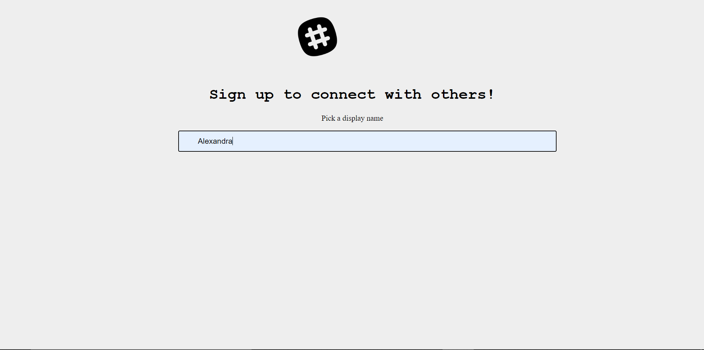
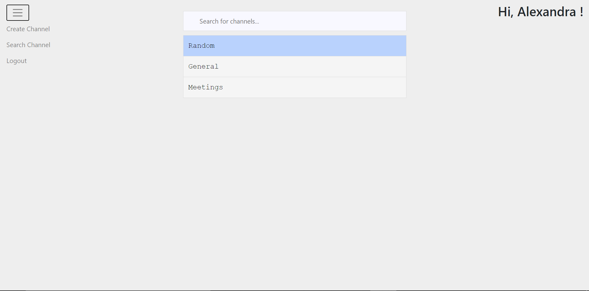
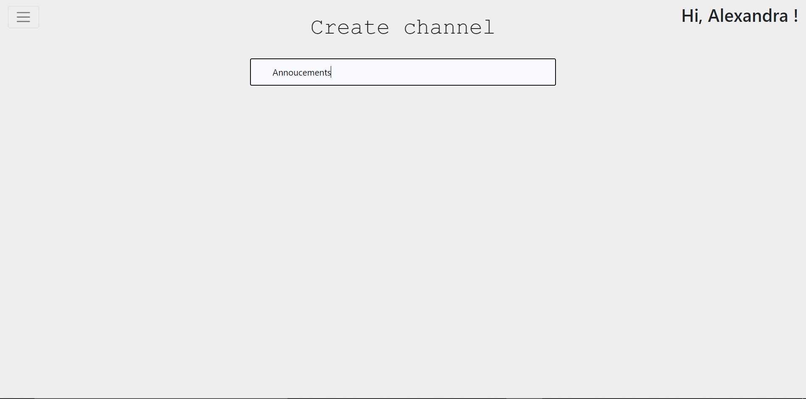
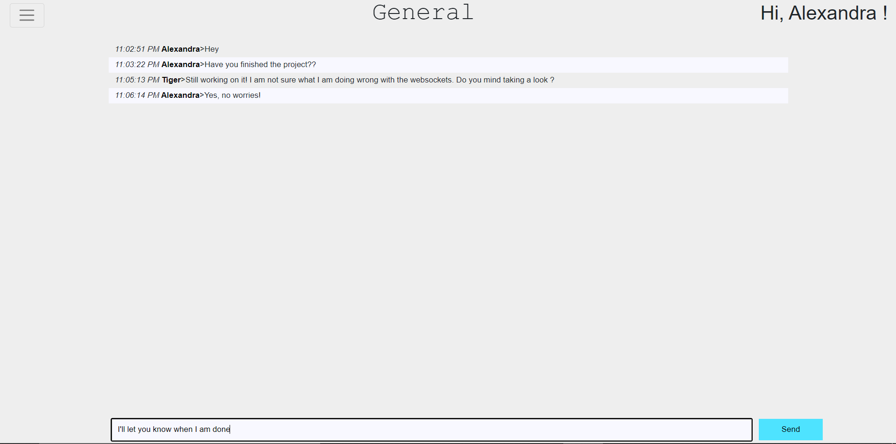

# Messaging App
A Flask website using Javascript and WebSocketio that allows users to communicate instananously. The user is able to pick a display name, create new channels and post messages.






## Installation
> Clone the repo

``` git clone https://github.com/agil98/Web-Development-Course```
> Install all dependencies

``` pip install -r requirements.txt ```
> Set the environment variables, _FLASK_APP_ and _SECRET_KEY_
